# IU INTERNATIONAL UNIVERSITY OF APPLIED SCIENCES
### Model Engineering (DLBDSME01) - **Task 1: Development of an Interpretable Model for Breast Cancer Prediction**

Abstract: 
....

### Purpose
According to the breast cancer is one of the most common cancer types overall. Diagnosing a breast pathology in time is very important since it significantly increases the chances of successful treatment and survival. Thus, a fast and accurate classification of a tumor as benign or malignant is important. Moreover, to increase technology acceptance, the trustworthiness of the approach is critical.

A group of oncologists have seen impressive breast cancer identification results from an AI algorithm on a fair. However, the group did not understand why the model predicted certain tumors as malign and others as benign - the validity of the model was questioned in some cases. The group also discussed the most important features for the predictions. Finally, they decided to ask a group of data scientists, you are one of them, for possibilities to understand the prediction of a possible machine learning model. Your task is to develop a classification model that predicts a tumor to be malignant or benign with high accuracy (F1 score > 0.95). Moreover, the model should be interpretable. The outcomes should be presented/communicated to non-experts to convince them about the trustworthiness of the chosen approach.

### Task
Support a group of oncologists with the interpretable prediction model to allow for additional indications that can be produced automatically as well as support understanding to ease technology acceptance.

# Project Organization
**Git Project Structure**

The project will be organized using the CRISP-DM (Cross-Industry Standard Process for Data Mining) method. This method provides a structured approach to organizing and executing data science projects. The proposed Git repository structure is as follows:

**data/original_data**: This folder will contain the dataset and any additional data files.
- `dataset.csv`: File with a list of IDs, labels, and features for breast cancer classification.
- `Addition_Information_Case_Study_Task_1.pdf`: File will information about the `dataset.csv` (columns, attributes, further info)

**data/processed_data**: Act as staging area.
- Data that is processed is stored in central database MongoDB under the `processed_data` collection along with metadata for versioning and how the data has been processed.
- This folder is purely for staging and should not really be used to store data. For sake of simplicity data in the notebooks is not loaded from the database but the general concept and metadata is still explained and given.

**docs**: Documentation related to the projec including the necessary created documents and media created during the training, evaluation, deployment and additional for clarifying the process.
- `README.md`: Main project documentation.
- `project_report.pdf`: Final project report summarizing findings and decisions.
- `media`: Images

**notebooks**: This folder will include Jupyter notebooks used for data exploration.
- `exploratory_data_analysis.ipynb`: Notebook for exploring the dataset.

**scripts**: Any supporting scripts used in the project to processed data or interact with database.
- `database.py`: Contains all methods to connect and insert original or processed data to the MongoDB database collections `original_data` and `processed_data`.
- `write_original_data.py`: Python script commiting the original data to the database with metadata enrichment for data versioning.
- `write_processed_data.py`: Python script for commiting processed data to the database with metadata and include the data processing steps.
- `README.md`: For for clarification.

**source**: Contains the model_training, model_evaluation and model_deployment steps of CRISP-DM.
- **source/model_training**:
  - `model_training.ipynb`: Notebook for training different candidate models.
  - `train_logistic_reg_best_model_2024-02-29.joblib`: Trained model using LogisticRegression model from scikit-learn.
  - `train_model_best_cv_nsplit_accuracy.csv`: Training artifact to see best cross-validation splits using accuracy metric.
  - `train_model_result_metrics.csv`: All trained models with their individual performances and their interpretability:
    - Model, Interpretability, F1 Score, ROC AUC, Recall, Precision, Accuracy (Testing), Accuracy (Training)
- **source/model_evaluation**:
  - `model_evaluation.ipynb`: Notebook for evaluating model performance.
  - `evaluate_best_model_feature_importance_standardized_vs_regular_ci.csv`: Evaluation artifact containing the most important features, their ci error interval, standardized and non-standardized values.
- **source/model_deployment**: Folder for model deployment, including `Dockerfile` for building an image.
  - `/html`: Folder with front-end index.html file and css.
  - `dataset.csv`: Used by the Dockerfile make the current dataset available (used for predictions, PCA1 & PCA2 mappings)
  - `main.py`: File used by FastAPI
  - `requirements.txt`: Python module requirements to be installed in the Docker image.
  - `train_logistic_reg_best_model_2024-02-29.joblib`: Saved LogisticRegression model that is loaded in the Docker image for predictions.
  - `README.md`: Additional information on Docker Image - Use, Building, etc.

`.gitignore`: File to ignore github uploads of venv, venv-docker, __pycache__

`LICENSE`: License file

`requirements.txt`: Requirements file to run the notebooks.

# Dataset Quality Evaluation
A thorough exploration of the dataset using Exploratory Data Analysis (EDA), examining statistical summaries, distributions, and relationships between variables.

**Diagnosis Distribution**

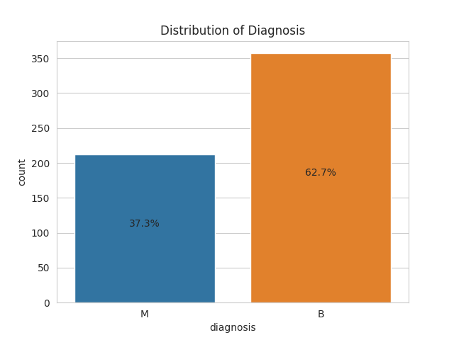

**Boxplots**

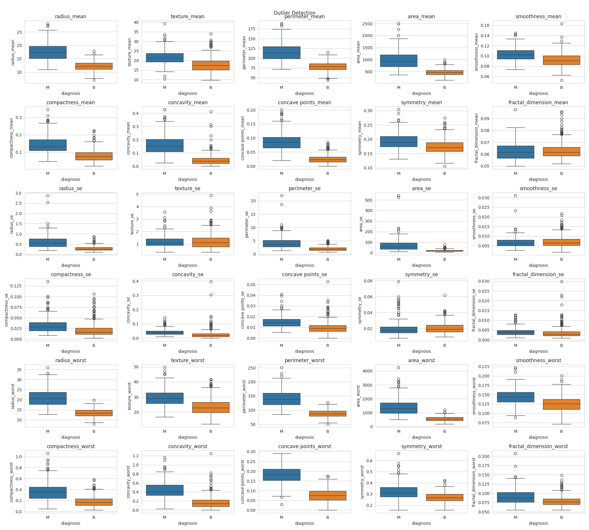

**Histplot with KDE**

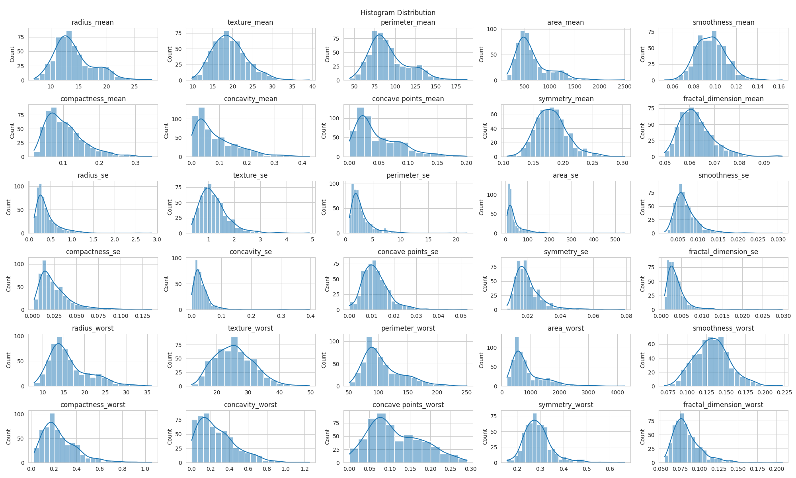

**Outliers**

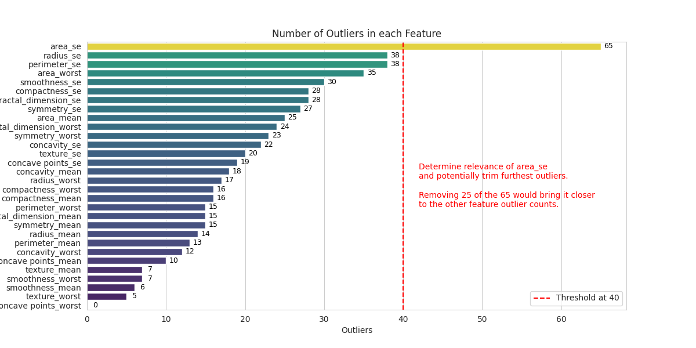

**Correlation Heatmap**

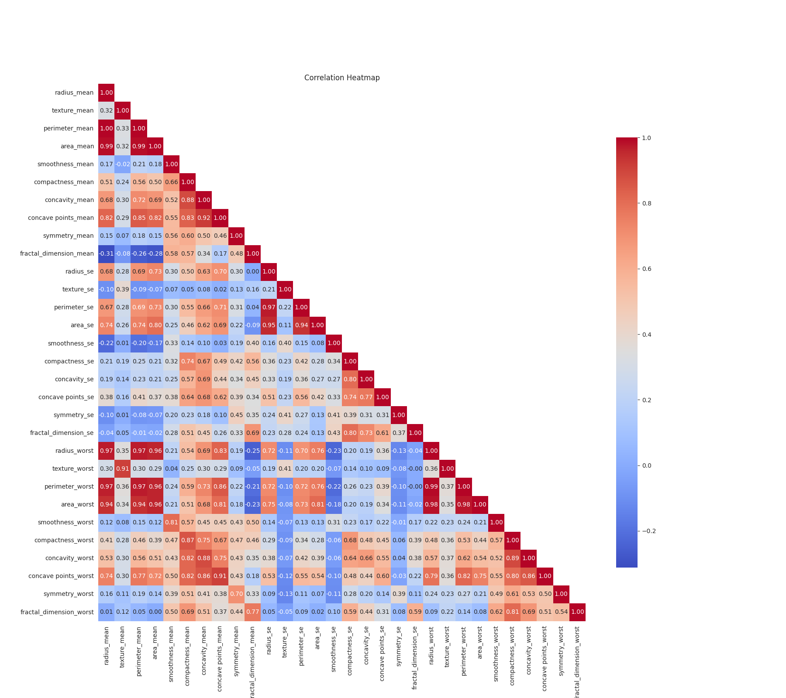

**Optimal Clusters KMeans**

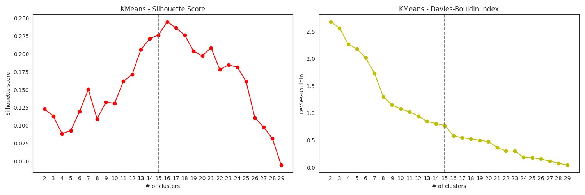

**Optimal Clusters SpectralClustering**

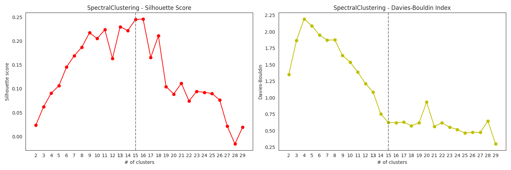

**Pairplot Mean**

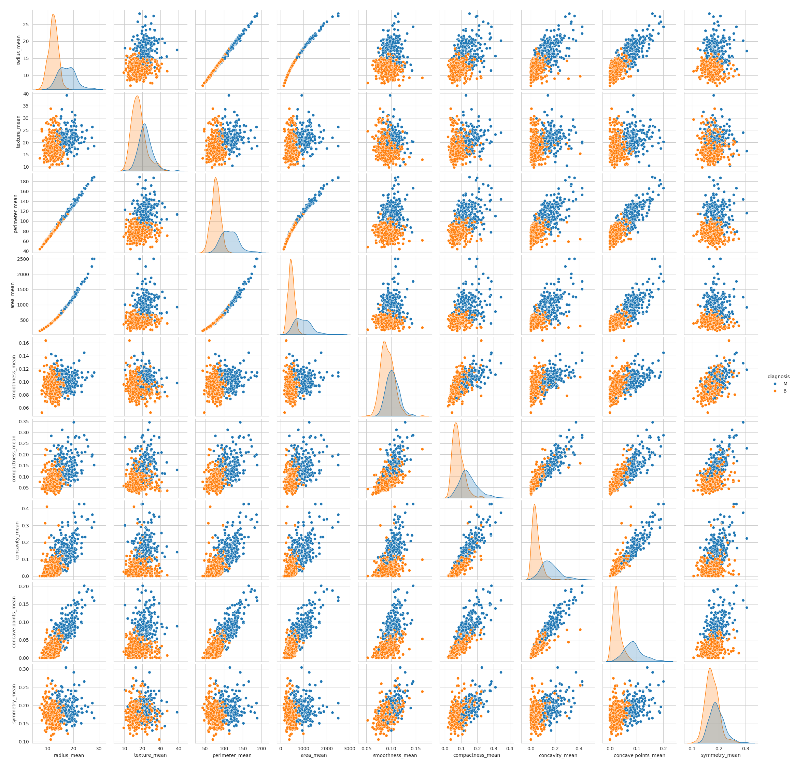

**Pairplot SE**

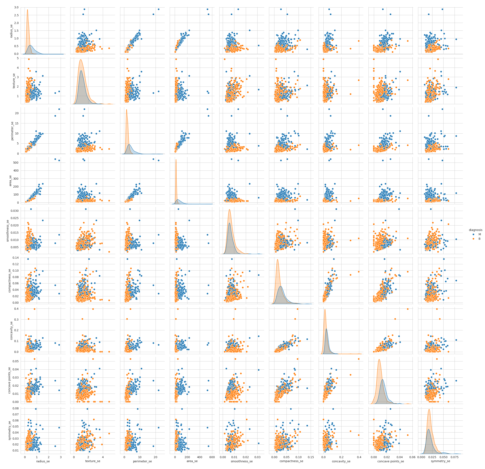

**Pairplot Worst**

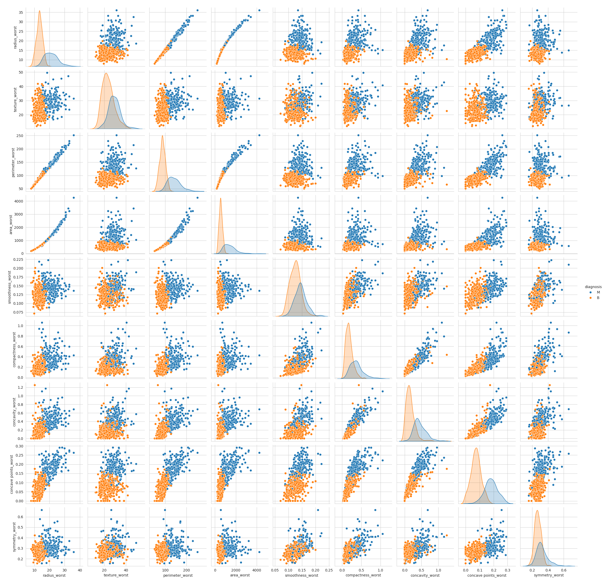

**PCA Clusters**

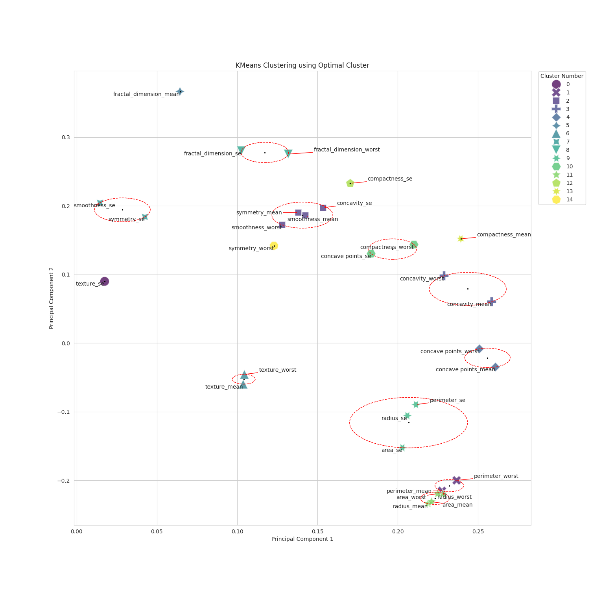

# Candidate Models
**Interpretability Rating**

**Comparison ROC AUC Scores**

**Selected Train Model Accuracies**

## Interpretability
To ensure the developed model is interpretable a rating has been established.
Interpretability in machine learning refers to the ease with which a human can understand the reasons behind a model's decision. Here’s what the interpretability ratings mean for the various models:

- Best: These models are typically transparent with outcomes that are easily traceable to specific model inputs. Models like Logistic Regression, Ridge Classifier, and Decision Tree allow users to see the direct relationship between feature changes and prediction outcomes. Their decisions can often be expressed in a simple, logical format that's comprehensible even without extensive statistical or machine learning background.

- High: High interpretability models like AdaBoostClassifier still provide a clear understanding of how input features affect predictions, but they might combine multiple weak learners. While each individual decision tree in the AdaBoost algorithm is interpretable, the ensemble method that combines these trees is slightly less so because it aggregates many models’ decisions.

- Medium: Models such as RandomForest or GradientBoostingClassifier offer moderate interpretability. They consist of an ensemble of decision trees, which individually are interpretable but when combined, the ensemble's decision process becomes more opaque due to the complexity of multiple trees voting.

- Low: Models like GaussianProcessClassifier or KNeighborsClassifier have lower interpretability because their decision-making processes are more complex and harder to trace back to individual features. For instance, KNeighborsClassifier makes predictions based on the proximity to other data points, which doesn’t provide a clear rule-based decision path.

- Worst: Models such as PassiveAggressiveClassifier or SGDClassifier fall into the 'worst' category for interpretability. These models, especially when using non-linear transformations, make it very difficult to understand how input data is being transformed into predictions, often acting as "black boxes" where the internal workings are not visible or comprehensible to users.

In summary, the interpretability rating guides users on how approachable a model's decisions are for analysis and understanding, with 'best' being most transparent and 'worst' being least.

## Importance of Explanatory Variables
Ranked by Standardized Coefficient (high to low means importance)

| Feature                   | Standardized Coefficient | CI Lower (Standardized) | CI Upper (Standardized) | Original Scale Coefficient | CI Lower (Original Scale) | CI Upper (Original Scale) |
|---------------------------|--------------------------|-------------------------|-------------------------|----------------------------|---------------------------|---------------------------|
| texture_worst             | 1.24                     | 1.24                    | 1.24                    | 0.20                       | 0.20                      | 0.21                      |
| radius_se                 | 1.17                     | 1.04                    | 1.30                    | 4.14                       | 3.66                      | 4.61                      |
| symmetry_worst            | 1.14                     | 0.93                    | 1.35                    | 18.11                      | 14.76                     | 21.46                     |
| concave points_mean       | 0.97                     | 0.07                    | 1.87                    | 25.52                      | 1.78                      | 49.26                     |
| concavity_worst           | 0.89                     | 0.78                    | 1.00                    | 4.25                       | 3.71                      | 4.80                      |
| radius_worst              | 0.86                     | 0.83                    | 0.88                    | 0.18                       | 0.17                      | 0.18                      |
| area_se                   | 0.84                     | 0.84                    | 0.84                    | 0.02                       | 0.02                      | 0.02                      |
| area_worst                | 0.82                     | 0.82                    | 0.82                    | 0.00                       | 0.00                      | 0.00                      |
| concave points_worst      | 0.80                     | 0.39                    | 1.21                    | 12.25                      | 5.96                      | 18.53                     |
| concavity_mean            | 0.75                     | 0.30                    | 1.21                    | 9.50                       | 3.77                      | 15.23                     |
| compactness_se            | -0.74                    | -1.63                   | 0.16                    | -39.58                     | -87.94                    | 8.79                      |
| perimeter_se              | 0.67                     | 0.65                    | 0.68                    | 0.32                       | 0.31                      | 0.33                      |
| perimeter_worst           | 0.64                     | 0.64                    | 0.64                    | 0.02                       | 0.02                      | 0.02                      |
| smoothness_worst          | 0.62                     | 0.01                    | 1.23                    | 26.84                      | 0.33                      | 53.35                     |
| fractal_dimension_se      | -0.59                    | -5.44                   | 4.25                    | -213.70                    | -1,953.39                 | 1,525.99                  |
| area_mean                 | 0.49                     | 0.49                    | 0.49                    | 0.00                       | 0.00                      | 0.00                      |
| Intercept                 | -0.49                    | -30.83                  | -30.68                  | -30.76                     | -30.78                    | -30.73                    |
| texture_mean              | 0.48                     | 0.47                    | 0.48                    | 0.11                       | 0.11                      | 0.11                      |
| symmetry_se               | -0.46                    | -1.67                   | 0.76                    | -55.75                     | -204.65                   | 93.15                     |
| radius_mean               | 0.45                     | 0.38                    | 0.53                    | 0.13                       | 0.11                      | 0.15                      |
| compactness_mean          | -0.44                    | -1.03                   | 0.16                    | -8.35                      | -19.69                    | 2.99                      |
| perimeter_mean            | 0.42                     | 0.41                    | 0.43                    | 0.02                       | 0.02                      | 0.02                      |
| concave points_se         | 0.28                     | -2.13                   | 2.69                    | 44.27                      | -339.11                   | 427.66                    |
| smoothness_se             | 0.28                     | -2.47                   | 3.02                    | 90.52                      | -809.28                   | 990.33                    |
| symmetry_mean             | -0.19                    | -0.52                   | 0.13                    | -7.10                      | -18.85                    | 4.66                      |
| fractal_dimension_mean    | -0.17                    | -2.64                   | 2.29                    | -23.99                     | -365.88                   | 317.91                    |
| fractal_dimension_worst   | 0.17                     | -0.89                   | 1.22                    | 9.30                       | -49.89                    | 68.48                     |
| texture_se                | -0.15                    | -0.16                   | -0.13                   | -0.27                      | -0.30                     | -0.24                     |
| smoothness_mean           | 0.10                     | -0.77                   | 0.97                    | 7.24                       | -55.54                    | 70.02                     |
| concavity_se              | -0.08                    | -0.63                   | 0.46                    | -2.63                      | -19.73                    | 14.47                     |
| compactness_worst         | 0.02                     | -0.15                   | 0.19                    | 0.13                       | -0.95                     | 1.22                      |

## Detailed Error Analysis
**Confusion Matrix**

The confusion matrix visualizes the classification accuracy of a model, indicating correct and incorrect predictions for benign and malignant tumors:

- 354 True Negatives: Benign tumors correctly identified.
- 207 True Positives: Malignant tumors correctly identified.
- 3 False Positives: Benign tumors incorrectly labeled as malignant.
- 5 False Negatives: Malignant tumors missed, incorrectly labeled as benign.

The matrix reveals that while the model is largely accurate, it errs slightly more towards false negatives than false positives, a significant concern in cancer diagnosis due to the potential for delayed treatment.

To improve, scrutinizing features leading to false negatives and adjusting the classification threshold could be key steps. The confusion matrix serves as a diagnostic tool, clarifying where the model succeeds and where it needs refinement, guiding enhancements to increase its diagnostic precision.

**Feature Importance Rank**

The bar chart represents feature importance in a logistic regression model for breast cancer prediction. Positive standardized coefficients suggest a feature increases the likelihood of a malignant classification, whereas negative values imply an association with benign predictions. The chart itself doesn't indicate prediction errors but highlights features' relative importance.

Key positively influential features, such as 'texture_worst' and 'radius_se', suggest a strong link with malignant cases. Conversely, features with significant negative coefficients likely indicate benign outcomes. Analyzing misclassifications in light of these importance rankings can uncover potential data quality issues or suggest areas for model improvement, such as:

- Examining high-importance features for their role in misclassified predictions to refine feature selection or data collection.
- Considering the elimination of features with minimal impact to streamline the model.
- Investigating the clinical implications of influential features in collaboration with medical experts to ensure the model's practical applicability.

Ultimately, while feature importance provides a roadmap for which variables most affect the model's decisions, understanding their impact on the model's accuracy and integrating clinical expertise are crucial for enhancing the model's diagnostic utility.

**PCA Predict Correct-Incorrect**

The PCA scatter plot reveals the performance of a logistic regression model used for breast cancer classification. The plot visualizes data reduced to two principal components (PC1 and PC2) and color-codes points based on the model's accuracy in predicting benign and malignant cases.

Observations from the plot indicate:

- True Positives (TP): Correct predictions of malignant cases (light blue dots).
- True Negatives (TN): Correct predictions of benign cases (orange dots).
- False Negatives (FN): Malignant cases incorrectly predicted as benign (black crosses).
- False Positives (FP): Benign cases incorrectly predicted as malignant (black 'X's).

The PCA plot showcases regions where the model has difficulty distinguishing between classes, especially where false negatives and positives cluster around the decision boundary. These areas point to potential improvements in the model's ability to differentiate between tumor types. Specifically, false negatives are critical in medical diagnostics as they represent missed diagnoses of malignant tumors.

PCA helps by transforming complex data into a simpler form for visual inspection and revealing decision boundaries. The errors visualized suggest that enhanced feature engineering or advanced modeling techniques might improve discrimination power. Further investigation could also include in-depth data quality assessment and integrating domain expertise into feature selection and model refinement.

For improvements, one could consider:

- Developing new or modified features that could help reduce overlap between classes.
- Increasing model complexity, perhaps exploring nonlinear classifiers that might better capture the boundary between classes.
- Reinforcing data preprocessing to minimize noise impact and reviewing outlier management strategies.
- Engaging with medical professionals to understand misclassifications and refine the model accordingly.

**ROC Curve**

The Receiver Operating Characteristic (ROC) curve presented in the image is a tool used to assess the performance of classification models. It plots the True Positive Rate (TPR) against the False Positive Rate (FPR) at various threshold levels. An Area Under the Curve (AUC) value of 1.00, as shown, suggests a model that perfectly distinguishes between the positive (malignant tumors) and negative (benign tumors) classes.

However, an AUC of 1.00 in practical scenarios often raises questions about overfitting, data quality, or evaluation methodology, as it is highly uncommon to achieve perfect classification. A model without any visible false positives or false negatives, as implied by this ROC curve, would typically be met with skepticism, particularly in complex fields such as medical diagnostics.

The ROC AUC metric is valuable for summarizing a model's predictive accuracy, encapsulating the trade-off between sensitivity (TPR) and specificity (1-FPR). An ideal ROC curve would show a steep ascent towards the top-left corner of the plot, indicating high sensitivity and specificity. Nevertheless, the perfect score depicted here necessitates a thorough review of the data and model evaluation procedures to validate the integrity of these findings.

For future improvement, it is recommended to:

- Conduct a rigorous cross-validation process to detect any data leakage.
- Re-examine the dataset for potential biases or class imbalance.
- Validate the model against an independent dataset to confirm generalizability.
- Consider the possibility of overfitting and evaluate the model complexity to ensure it is appropriate for the data's inherent complexity.

# Making the Model Accessible for Operations
## Front-end of Docker API
### See more information in [source/model_deployment/README.md](./source/model_deployment/README.md)
The trained model uses the Logistic Classifier that performed the best according to all the collected metrics and results.

- The user can select one of the example data to be predicted by the model or fill out their own numeric data.
- The user clicks predict.
- The predicted class (B)enign or (M)alignant, class probabilty and how it relates to the trained model predictions on the PCA1 and PCA2 is displayed.
- The PCA plot gives great insight how the newly classified datapoint relates and if it is close to the incorrectly predicted ones or where the two classes are difficult to distinguish extra care can be taken.

**Docker-api Front-end**

The user interface (UI) showcased is designed for clinicians to apply a logistic classifier for breast cancer detection. Through the UI, medical professionals can swiftly input patient data or choose preset examples, receive instant model predictions (benign or malignant), and view probability scores. The integrated PCA plot visualizes where the new data point falls relative to the model’s training, highlighting the certainty of the prediction and areas where the model may be less reliable.

Incorporating this tool into daily medical practice involves training staff to use the UI and interpret PCA outputs, embedding the system into existing health record software for ease of access, and using the model's insights to augment clinical decision-making. Essential to adoption are clear explanations of model terms and predictions, a feedback feature for continuous model enhancement, and alerts for ambiguous cases. This setup not only improves diagnostic workflows but also builds trust in AI-assisted decision-making.

## How to get started
### Dependencies for using the Jupyter Notebooks
Create a new virtual python environment for the notebooks.

`python3 -m venv venv`

Activate the environment (Linux)

`source venv/bin/activate`

Install the dependencies

`pip3 install -r requirements.txt`

## API usage using pre-build docker image
### Pull the latest build image
`docker pull deusnexus/breast_cancer_classification:latest` 
### Run the container
`docker run --name breast_cancer_classification -p 8000:8000 deusnexus/breast_cancer_classification:latest`
### Open the API on localhost
`http://127.0.0.1:8000`

# Reflection
...

# Conclusion
...

# Disclaimer
The developed application is licensed under the GNU General Public License.
